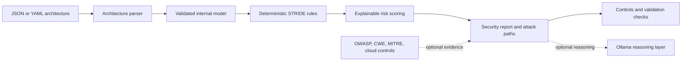

# System Design

The deterministic path is the system of record. Future AI and retrieval components enrich a finding only when they can provide evidence; they do not replace reproducible security rules.
